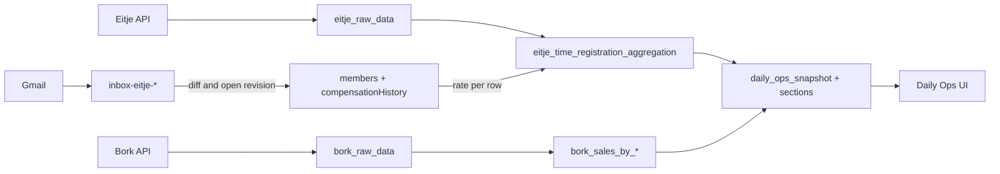

# Daily Ops — Compensation Revisions + Architecture Lock-in

## Goal

Make the architecture durable and AI-discoverable, then add forward-only compensation history to workers so labor costs are correct and traceable per contract change, across nul-uren / uren contract / zzp.

## Locked decisions (seed `DECISIONS.md` as ADRs)

- **ADR-001:** `members` is the SSOT for current compensation. Remove the inbox-contracts fallback in [server/api/members/[id].get.ts](server/api/members/[id].get.ts) (lines 77–88).
- **ADR-002:** Effective date = detection date (forward-only). `contract_start_date` when present, else `importedAt`. No retroactive rebuild in v1.
- **ADR-003:** `members.unified_user_id` is the canonical cross-system FK. Fuzzy multi-key matching in [server/utils/memberEitjeContext.ts](server/utils/memberEitjeContext.ts) becomes admin/repair-only.
- **ADR-004:** `daily_ops_snapshot` + `daily_ops_snapshot_section_*` are the only dashboard read source. No on-the-fly math in UI.
- **ADR-005:** Revisions are idempotent — only insert when tracked fields change (`contract_type`, `hourly_rate`, `cost_per_hour`).

## Target data flow

## Phase 0 — Documentation foundation (docs only, no code)

Create at repo root:

- `ARCHITECTURE.md` — purpose, data flow (mermaid), collection inventory (purpose / SSOT / writers / readers), canonical entities, business rules (08:00 Amsterdam business day, VAT ex/inc, nul-uren ×1.36, compensation SSOT), inbox vs API, snapshot read-only model, conventions (effective dating, idempotency, metadata headers), future AI extraction layer.
- `DECISIONS.md` — append-only ADR log, seeded with ADR-001…005.
- `ROADMAP.md` — what is coming (manual rate-effective override, AI extraction layer).

Update at repo root:

- `README.md` — top link block: "If you read nothing else, read `ARCHITECTURE.md`."

Update rules:

- `.cursor/rules/agent-rules.mdc` — add a line under Rule #0: "If a change affects business rules or data SSOT, update `ARCHITECTURE.md` and add an ADR in `DECISIONS.md` in the same commit. Reference ADRs from metadata headers via `@adr-ref:`."

Create under `dev-docs/`:

- `dev-docs/COMPENSATION_REVISIONS_PLAN.md` — implementation-only doc; archived after ship; references ADRs.

## Phase 1 — Identity FK (`members.unified_user_id`)

- Define `members.unified_user_id?: ObjectId` (nullable) in member docs; add a Mongo index.
- One-time backfill script `scripts/backfill-members-unified-user-id.ts` using the same logic as `resolveEitjeAggregationUserCandidates` in [server/utils/memberEitjeContext.ts](server/utils/memberEitjeContext.ts).
- Extend `unified_user` upserts in [server/services/eitjeSyncService.ts](server/services/eitjeSyncService.ts) (lines ~708–766) so when a `unified_user` is matched/created for a known `support_id`, the corresponding `members` doc is updated with `unified_user_id`.
- `memberEitjeContext` keeps fuzzy resolver only when FK is missing.

## Phase 2 — Revision schema + write path on `members`

- New file `types/member-compensation.ts`:
  - `type CompensationRevision = { effective_from: Date; effective_to: Date | null; contract_type: string; hourly_rate: number | null; cost_per_hour: number | null; cost_model: 'stored_cph' | 'nul_uren_1_36' | 'zzp_invoice' | 'manual'; source: 'inbox_eitje_contract' | 'manual_ui' | 'migration_seed'; source_ref?: string; created_at: Date }`
- New util `server/utils/memberCompensationRevisions.ts`:
  - `materialFieldsChanged(prev, next)` — diff guard (ADR-005).
  - `openNewRevision(db, memberId, next, source, sourceRef, asOf)` — closes prior open row, inserts new row, mirrors current fields (`contract_type`, `hourly_rate`, `cost_per_hour`) on `members` for fast reads.
- Ingestion hook: on `inbox-eitje-contracts` insert path, if matched to a member, call `openNewRevision` with `source='inbox_eitje_contract'`, `asOf = importedAt` (or `contract_start_date` if present, per ADR-002).
- Manual edits: extend [server/api/members/[id].put.ts](server/api/members/[id].put.ts) to accept `contract_type`, `hourly_rate`, `cost_per_hour` and call `openNewRevision` with `source='manual_ui'`.
- Refactor [server/api/members/[id].get.ts](server/api/members/[id].get.ts):
  - Remove inbox-eitje-contracts fallback block (lines 77–88).
  - Add `compensation_status: 'ok' | 'missing'` based on current denormalized fields.
  - Return `compensationHistory` array.

## Phase 3 — UI surfacing

- [pages/members/[id].vue](pages/members/[id].vue): add a Compensation History panel rendering `member.compensationHistory[]` (current row highlighted, prior intervals listed).
- [pages/daily-ops/inbox/eitje-staff.vue](pages/daily-ops/inbox/eitje-staff.vue): add a 4th block "Missing compensation" listing rows whose matched `members` doc has `compensation_status === 'missing'`. Status badge per row.
- Extend [server/api/daily-ops/eitje-staff.get.ts](server/api/daily-ops/eitje-staff.get.ts) to surface that status alongside existing match confidence.

## Phase 4 — Aggregation alignment (forward-only)

- Update [server/utils/eitjeLoadedCostStages.ts](server/utils/eitjeLoadedCostStages.ts) and [server/utils/eitjeLoadedCostEmployerStages.ts](server/utils/eitjeLoadedCostEmployerStages.ts) resolution priority: `members.cost_per_hour` → revision lookup matching `period` against `compensationHistory` → existing inbox-contracts lookup (legacy fallback).
- For v1 (forward-only), `members.cost_per_hour` alone is sufficient since denormalized current = latest open revision.
- Old `eitje_time_registration_aggregation` rows + `daily_ops_snapshot*` documents are not rewritten (ADR-002).

## Phase 5 — Snapshot verification

- No code change to snapshot writers ([server/utils/dailyOpsSnapshot/buildLaborSection.ts](server/utils/dailyOpsSnapshot/buildLaborSection.ts) keeps consuming agg outputs).
- Run [scripts/validate-snapshot-phase-a1.ts](scripts/validate-snapshot-phase-a1.ts) for a known `(businessDate, locationId)` after Phase 4 to confirm parity.

## Phase 6 — Future work (record in `ROADMAP.md`, do not implement)

- Manual "rate started on date X" override with scoped re-aggregation of `(member, period range)` and snapshot rebuild via the existing job coalescer.
- AI extraction layer: MCP/tool catalogue over snapshots + members + revisions.

## Agent-rules constraints applied throughout

- Rule #0: Each phase requires explicit approval before edits.
- Rule #1: `grep '"file":' function-registry.json` before editing any service / API file in scope.
- Rule #2: Honor `touch_again: false`; ask first.
- Rule #4: ≤100 lines per change, ≤20 lines per delete; no >80% replacements.
- Rule #5: No `any` without justification.
- Rule #9: No `console.log` in production paths; structured errors only.
- Rule #11: Every modified critical file updates `@last-modified` and `@last-fix`; add `@adr-ref:` where relevant; commit modified file + dependents together.

## Out of scope (v1)

- Retroactive rebuild of past agg/snapshot rows when a wage change is detected (ADR-002).
- Bork worker denormalization onto `members` (cross-system stays through `unified_user`).
- AI extraction layer code (Phase 6 only as roadmap entry).