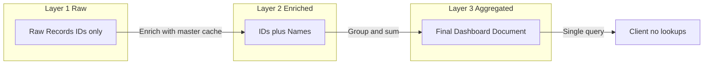

# Daily Ops Build Plan

**Source of truth:** [.cursor/plans/BUILD_PLAN_PHASES.md](.cursor/plans/BUILD_PLAN_PHASES.md) (full phase breakdown, file list, rules checklist).

---

## Approach

**Final view first (contract):** Define what the dashboard needs (`product_name`, `team_name`, `location_name`, etc.). All of it embedded in the aggregated document so the client never does lookups.

**Build backwards through layers:**

- **Layer 1:** Flat raw data (IDs only); one doc per row/transaction; CSV + API normalized into same collections.
- **Layer 2:** Enrichment: load master data once, add names via O(1) cache lookups; output = IDs + names (in memory for aggregation).
- **Layer 3:** One aggregated document per day per location; all names embedded; one query serves the dashboard.

**Stack:** Next.js 15, React 18, TypeScript, Tailwind, Shadcn UI, MongoDB, Socket.io.  
**Constraints:** SSR first, modular services, MVVM (ViewModels = hooks, View = components), [.cursor/rules/agent-rules.mdc](.cursor/rules/agent-rules.mdc) (metadata headers, registry check, no `any`, pagination, small commits).

---

## Phases (4 weeks)

| Phase | Focus                                 | Key deliverables                                                                                                                                                                                                                     |
| ----- | ------------------------------------- | ------------------------------------------------------------------------------------------------------------------------------------------------------------------------------------------------------------------------------------ |
| **0** | Preparation (1 day)                   | [app/lib/types/dashboard.types.ts](app/lib/types/dashboard.types.ts), enrichment.types.ts, raw-data.types.ts; [app/models/ProductMaster.ts](app/models/ProductMaster.ts), CategoryMaster.ts, ContractTypeMaster.ts                   |
| **1** | Master data layer (3 days)            | [app/lib/services/cache/masterDataCacheService.ts](app/lib/services/cache/masterDataCacheService.ts); collection ensure + indexes; Location credentials if needed                                                                    |
| **2** | Source collectors (5 days)            | [app/lib/services/sync/emailSnapshotCollector.ts](app/lib/services/sync/emailSnapshotCollector.ts), apiSnapshotCollector.ts; [app/lib/services/data-sources/](app/lib/services/data-sources/) (eitje/bork CSV + API import services) |
| **3** | Enrichment (4 days)                   | [app/lib/services/enrichment/laborEnrichmentService.ts](app/lib/services/enrichment/laborEnrichmentService.ts), salesEnrichmentService.ts; validation services (eitje, bork)                                                         |
| **4** | Aggregation (4 days)                  | [app/lib/services/aggregation/dailyOpsAggregationService.ts](app/lib/services/aggregation/dailyOpsAggregationService.ts); [app/api/cron/daily-aggregation/route.ts](app/api/cron/daily-aggregation/route.ts)                         |
| **5** | Snapshots and reconciliation (3 days) | [app/lib/services/sync/snapshotReconciliationService.ts](app/lib/services/sync/snapshotReconciliationService.ts); cron routes for email (08/15/19/23) and API (hourly)                                                               |
| **6** | Server actions and API (3 days)       | [app/actions/daily-ops.ts](app/actions/daily-ops.ts) (getDailyDashboard, getRevenueBreakdown, etc.); [app/api/data/import/](app/api/data/import/) and validation status                                                              |
| **7** | React MVVM (5 days)                   | Hooks in [app/lib/hooks/](app/lib/hooks/) (useDailyOpsDashboard, useRevenueBreakdown, …); dashboard components in [app/components/dashboard/](app/components/dashboard/); [app/daily-ops/page.tsx](app/daily-ops/page.tsx)           |
| **8** | Testing and validation (3 days)       | Unit tests for enrichment and aggregation; integration test for cron; manual checklist (CSV, API, enrichment, validation, dashboard, no lookups)                                                                                     |

---

## Rules compliance

- **RULE #0:** Full plan and file list in BUILD_PLAN_PHASES.md; confirm before execute.
- **RULE #11:** Every critical file (services, hooks, API routes, types) has metadata header with @registry-id, @exports-to, @last-modified, @last-fix.
- **Registry:** `grep` function-registry.json before editing; respect `touch_again: false`.
- **SSR:** Server Components by default; Client Components only where needed (`'use client'`); data via Server Functions / API routes.
- **No DB in UI:** All data access in [app/api/](app/api/) or server actions.
- **Types:** No `any`; use [app/lib/types/](app/lib/types/) across layers.
- **Modular:** One concern per service/file; keep changes within size limits (~100 lines/change, ~20 lines/delete).
- **MVVM:** Business logic and data shape in hooks (ViewModels); components only render props (View).

---

## Execution

- Implement phase by phase; each phase can be one or more small commits.
- After work: update function-registry.json (status, touch_again); commit with message like `feat: [what] in [where]`.
- No code shown during execution unless the user asks to "show me".

This plan places the existing BUILD_PLAN_PHASES.md content into a single, trackable build plan; that file remains the detailed reference for files, types, and checklists.