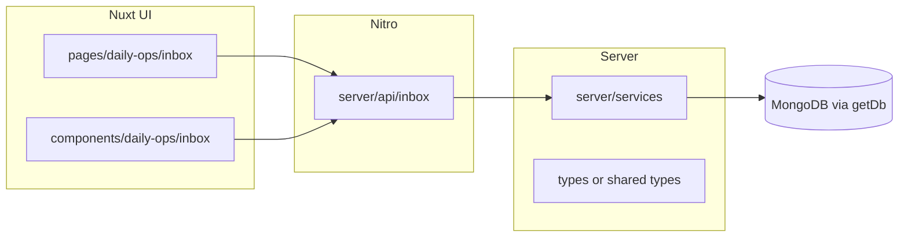

# Inbox import: Next (`next-js-old`) → Nuxt rebuild

## Working principle

The **legacy Next.js app is preserved on branch `next-js-old`** (also `origin/next-js-old`); current Nuxt work is on branches like `main` / feature branches—not “mystery history” only. Rebuild **piece by piece**: for each slice, read the exact file from that branch with `git show next-js-old:<path>` (no need to hunt arbitrary SHAs first). Use [`.cursor/plans/INBOX_*.md`](.cursor/plans/) and [`dev-docs/INBOX_DATA_MAPPINGS.md`](dev-docs/INBOX_DATA_MAPPINGS.md) when you need schema/mapping context beyond the old code.

## Findings from the current tree

- The **active codebase is Nuxt** ([`package.json`](package.json): `nuxt` 4, dev on port 8080). There is **no** `app/` Next.js tree on **current HEAD**.
- **Routes and sidebar already exist**: [`pages/daily-ops/inbox/**/*.vue`](pages/daily-ops/inbox/) are **placeholders** (“Full UI in the Next.js app.”); [`components/AppSidebar.vue`](components/AppSidebar.vue) already links to every URL you listed.
- **No inbox backend on HEAD**: no [`server/api/inbox/`](server/api/) and no inbox services under [`server/services/`](server/services/).
- **Specification docs** (schemas, mappings, phases) live under [`.cursor/plans/INBOX_*.md`](.cursor/plans/) and [`dev-docs/INBOX_DATA_MAPPINGS.md`](dev-docs/INBOX_DATA_MAPPINGS.md); use these when git history is ambiguous.
- [`function-registry.json`](function-registry.json) is currently empty; still **add/register** new inbox entries as you implement (per agent rules).

## Source of truth: branch `next-js-old`

Use **`next-js-old`** as the single snapshot of the old Next app (not arbitrary commits on `main`).

**Discovery workflow:**

1. List inbox-related paths on that branch (adjust prefixes to match the tree):
   - `git ls-tree -r next-js-old --name-only | grep -E 'inbox|gmail|Gmail'` (or browse `app/api`, `app/daily-ops`, `app/lib` on that branch).
2. Read a file without switching branches:
   - `git show next-js-old:app/api/inbox/sync/route.ts` (example path—confirm with step 1).
3. Optional: diff against current Nuxt branch to see what disappeared:
   - `git diff next-js-old..HEAD -- app/api/inbox` (may be empty if Nuxt never had those files).
4. Build a **small inventory**: each `next-js-old` path → target Nuxt path (API / service / page / component).

Typical locations are described in [`.cursor/plans/INBOX_FILE_STRUCTURE.md`](.cursor/plans/INBOX_FILE_STRUCTURE.md); **verify against `git ls-tree next-js-old`** because layout may differ slightly.

## Target architecture (Nuxt)

| Legacy (Next) | Nuxt target |
|---------------|-------------|
| Route handlers `app/api/inbox/.../route.ts` | [`server/api/inbox/...`](server/api/) (`*.get.ts` / `*.post.ts`) using `defineEventHandler` |
| `app/lib/services/*` | [`server/services/inbox*.ts`](server/services/) (same business logic; **metadata headers** like [`borkRebuildAggregationService.ts`](server/services/borkRebuildAggregationService.ts)) |
| Types under `app/lib/types` | [`types/inbox.ts`](types/) (or project convention) |
| React pages/components | Vue SFCs: extend/replace stubs in [`pages/daily-ops/inbox/`](pages/daily-ops/inbox/) + shared components under e.g. `components/daily-ops/inbox/` |

**DB access:** Follow existing pattern in [`server/utils/db.ts`](server/utils/db.ts) (native `mongodb` driver). If legacy code used Mongoose, **translate** to driver calls or a thin repository layer—do not assume Mongoose is available ([`package.json`](package.json) has `mongodb`, not `mongoose`).

## UI shell and Nuxt UI

- **Default layout** already wraps content with sidebar ([`layouts/default.vue`](layouts/default.vue)); inbox pages sit in the main area like other daily-ops routes.
- Replace bare placeholder `
` pages with **Nuxt UI** (`UCard`, `UTable`, `UButton`, `UForm`, `UAlert`, loading/empty states) consistent with [`components/daily-ops/DailyOpsSectionPage.vue`](components/daily-ops/DailyOpsSectionPage.vue) / [`DailyOpsDashboardShell.vue`](components/daily-ops/DailyOpsDashboardShell.vue).
- **Decision:** Inbox does not need the period/location chrome from `DailyOpsDashboardShell` unless product wants parity—prefer a dedicated **`InboxPageShell`** (title + optional filters + slot) so inbox stays focused on email/document workflow. Confirm when implementing.

## Route map (your URLs → implementation intent)

| URL | Role |
|-----|------|
| `/daily-ops/inbox` | Dashboard: counts, recent activity, quick actions (sync status) |
| `/daily-ops/inbox/emails` | Paginated list + filters |
| `/daily-ops/inbox/upload` | Manual upload (multipart → parse pipeline) |
| `/daily-ops/inbox/[emailId]` | Email detail + attachments |
| `/daily-ops/inbox/eitje` … `finance` | Views filtered by document/source type **Eitje** (hours/contracts/finance)—likely query `parsed_data` or mapped collections per [`dev-docs/INBOX_DATA_MAPPINGS.md`](dev-docs/INBOX_DATA_MAPPINGS.md) |
| `/daily-ops/inbox/bork` … | Same pattern for **Bork** document types |
| `/daily-ops/inbox/power-bi` … | **Power-BI** imports/reports |
| `/daily-ops/inbox/other` … | Catch-all / test data |

Implement **shared list/detail primitives** first, then thin “section” pages that pass `documentType` or collection filters.

## Backend capabilities to port (from git + docs)

Order matches a safe **piece-by-piece** rollout:

1. **Types + collections** – Align with [`INBOX_FEATURE_BUILD_PLAN.md`](.cursor/plans/INBOX_FEATURE_BUILD_PLAN.md) (inbox emails, attachments, parsed data, processing log); index strategy in Mongo.
2. **Read APIs** – `GET` list/detail so UI can ship before Gmail sync is stable.
3. **Upload + parse** – `POST` upload/parse; reuse existing stack [`papaparse`](package.json), `xlsx`, `pdfjs-dist` where applicable.
4. **Gmail sync / webhooks** – Port OAuth/sync/watch/webhook from legacy; align env vars with [`dev-docs/GMAIL_PUBSUB_SETUP.md`](dev-docs/GMAIL_PUBSUB_SETUP.md) and scripts like [`scripts/verify-webhook-setup.ts`](scripts/verify-webhook-setup.ts) (update script to target Nitro URLs, not “Next.js server”).
5. **Mapping jobs** – Write to target collections per [`INBOX_DATA_MAPPINGS.md`](dev-docs/INBOX_DATA_MAPPINGS.md) (Eitje/Bork/etc.).

## Agent rules compliance

- **Before editing:** `grep` [`function-registry.json`](function-registry.json) by file path; add inbox entries as features land.
- **Metadata headers** on new/changed **services, composables, API routes, shared types** (`@exports-to`, `@last-modified`, `@last-fix`)—mirror [`borkRebuildAggregationService.ts`](server/services/borkRebuildAggregationService.ts).
- **No `console.log`** in production paths; pagination on list endpoints; avoid `any`.
- **After changes:** `pnpm build` or `nuxi typecheck` and check dev server logs (per workspace rule #0.5).

## Suggested implementation slices (vertical milestones)

1. **Inventory commit** – Document recovered Next file list + mapping table (no feature code).
2. **Foundation** – Types, DB helpers, first `GET` API + empty state UI on `/daily-ops/inbox/emails`.
3. **Email detail** – `/daily-ops/inbox/[emailId]` + attachments metadata.
4. **Upload path** – `/daily-ops/inbox/upload` + `POST` parse.
5. **Category pages** – Eitje/Bork/PowerBI/Other as filtered views over the same APIs.
6. **Gmail + webhooks** – Sync and Pub/Sub last (most moving parts).

This keeps each step testable and avoids a big-bang merge.
