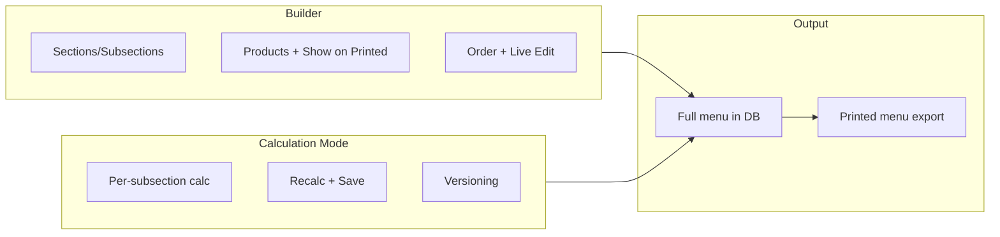

# Menu Builder V2 – Build Plan

## 1. Scope and architecture

- **V2 lives alongside V1:** New routes/pages under `daily-menu-products` (e.g. `menu-builder-v2/` or versioned API) so current [menu-builder/index.vue](nuxt-app/pages/daily-menu-products/menu-builder/index.vue) and [menu-builder/[id].vue](nuxt-app/pages/daily-menu-products/menu-builder/[id].vue) stay untouched until V2 is ready.
- **Two modes per menu:** (1) **Descriptive / Builder** – sections, subsections, product list, column toggles, order, “Show on Printed Menu”, live edit. (2) **Calculation mode** – per-subsection calculation table, recalc, save/autosave, optional versioning.
- **Printed menu:** Export (PDF/Word) includes only items with “Show on Printed Menu” = yes. Full menu (all items) used for calculations and checkout.

---

## 2. Data model and DB

- **Menus collection** (existing [server/utils/db.ts](nuxt-app/server/utils/db.ts) `getMenusCollection()`): Extend document with:
  - **Sections as tree:** Section has `id`, `name`, `**subsections`** (array of `{ id, name, productIds, productOverrides?, showOnPrintedMenu? }`). Or sections remain flat with a `parentId` to form section → subsection. Decide one model (nested subsections vs flat with parentId).
  - **Per-section defaults:** `defaultWastePercent`, `defaultMarginMultiplier`, `defaultVatRate` at section level (and optionally at subsection level).
  - **Copy relation:** `copiedFromMenuId?: ObjectId` for “Copy menu” to track lineage and price development.
- **Menu items (products):** Existing [menu_items](nuxt-app/server/utils/db.ts) collection; no schema change. V2 uses same items; menu stores only references and overrides.
- **Per-product in menu (overrides):** Extend [MenuProductOverride](nuxt-app/types/menuItem.ts) (or V2 type) with `**showOnPrintedMenu?: boolean`**. Store at subsection level: e.g. `productOverrides[productId].showOnPrintedMenu`.
- **Versioning:** New collection `menu_versions` or embedded `versions[]` on menu document: `{ savedAt, snapshot: menuSections + productOverrides }`. One document per save or per “version” action; used for “retrace step” only, not for live edit.

---

## 3. API (server)

- **Menus CRUD:** Keep [menus.get.ts](nuxt-app/server/api/menu/menus.get.ts), [menus.post.ts](nuxt-app/server/api/menu/menus.post.ts), [menus/[id].get.ts](nuxt-app/server/api/menu/menus/[id].get.ts), [menus/[id].patch.ts](nuxt-app/server/api/menu/menus/[id].patch.ts). Extend PATCH body to accept section/subsection tree and section-level defaults; validate and persist `copiedFromMenuId` on POST (copy).
- **Copy menu:** New endpoint `POST /api/menu/menus/copy` or `POST /api/menu/menus?copyFrom=:id`. Returns new menu with same structure and optional product list; set `copiedFromMenuId` to source.
- **Products list for add-products:** Existing [items.get.ts](nuxt-app/server/api/menu/items.get.ts) with **query params** `search`, `productType` (and optional filters) for search/filter; support **bulk add** (body: `{ menuId, sectionId, subsectionId?, productIds[] }`).
- **Export:** Extend [export/excel.get.ts](nuxt-app/server/api/menu/menus/[id]/export/excel.get.ts) or add Word/PDF export to **filter by showOnPrintedMenu**. Same for any PDF/Word export route used by V2.
- **Versioning:** New `POST /api/menu/menus/[id]/versions` to save current state; `GET /api/menu/menus/[id]/versions` to list; optional `GET .../versions/[versionId]` to load a snapshot (read-only for “retrace”).

---

## 4. Pages and views (V2)

| Page                  | View                 | Actions                                                                                                                                                                                                                                                                            |
| --------------------- | -------------------- | ---------------------------------------------------------------------------------------------------------------------------------------------------------------------------------------------------------------------------------------------------------------------------------- |
| **Menu list (V2)**    | List                 | Create menu, **Copy menu** (new from existing, set `copiedFromMenuId`), open, delete.                                                                                                                                                                                              |
| **Menu Builder (V2)** | Sections             | Add section (e.g. Beers). Per section: add subsections (Draft Beers, Bottled Beers, Ciders & Alcohol Free). Set **section-level defaults**: waste %, margin, VAT low/high. Save.                                                                                                   |
| **Menu Builder (V2)** | Add products         | **Search + filter** (productType, text); **bulk add** to subsection. Show prior menu/item data when available.                                                                                                                                                                     |
| **Menu Builder (V2)** | Subsection products  | Columns: ProductName, Brand, ProductType, Description, Year, %, Nett CostPriceOfSales, Margin, Nett MenuPrice, Bruto MenuPrice (toggle visibility per subsection). **Show on Printed Menu** yes/no per product. Drag-and-drop order. **Edit** mode: live edit names, descriptions. |
| **Menu Builder (V2)** | Export (descriptive) | PDF/Word of **printed menu** (only showOnPrintedMenu = true).                                                                                                                                                                                                                      |
| **Menu Builder (V2)** | Calculation mode     | Per subsection: open “Calculate”. Full calculation table; edit cost/amounts/bruto; recalc. Save; **autosave** (e.g. debounced). Optional “Save version” for versioning. Close → Builder shows last saved state.                                                                    |
| **Final**             | —                    | Printed menu = filtered export. Full menu = all items for calculations and checkout.                                                                                                                                                                                               |

---

## 5. Agent rules

- **Add/update in [.cursor/rules/agent-rules.mdc](.cursor/rules/agent-rules.mdc):**
  - Rule: **Menu Builder (V2)** – When touching `nuxt-app/pages/daily-menu-products/`*, `nuxt-app/composables/useMenu`*, `nuxt-app/server/api/menu/*`, or `nuxt-app/types/menuItem.ts`, check metadata headers and `@exports-to`; update dependents and registry if present.
  - Rule: **Menu calculations** – Row pricing and “Margin Final” logic live in composables ([useMenuRowCalculation.ts](nuxt-app/composables/useMenuRowCalculation.ts)); do not duplicate in pages. Use existing `getCostPerItemFromProduct`, `parseProductNumber`, and section/subsection defaults for V2.
- **Optional:** New file `.cursor/rules/menu-builder-v2.mdc` (alwaysApply: false) with: V2 route convention; section vs subsection terminology; “Show on Printed Menu” and “printed menu export” behavior; versioning = snapshot on save.

---

## 6. Metadata headers

- **Apply to all critical V2 and shared menu code** (same format as [dev-docs/cursor-old/metadata-header-format.md](dev-docs/cursor-old/metadata-header-format.md) and [.cursor/rules/METADATA-SYNC-GUIDE.md](.cursor/rules/METADATA-SYNC-GUIDE.md)): `@registry-id`, `@created`, `@last-modified`, `@description`, `@last-fix`, `@exports-to`, `@imports-from`.
- **Files to get headers (and keep updated):**
  - **[nuxt-app/types/menuItem.ts](nuxt-app/types/menuItem.ts)** – Menu, MenuSection, MenuProductOverride, Menu (V2 types when added). Describe: DB shape for menus and overrides; showOnPrintedMenu; section defaults.
  - **New or extended types** for V2: section/subsection tree, section defaults, copiedFromMenuId, version snapshot type.
  - **[nuxt-app/composables/useMenuRowCalculation.ts](nuxt-app/composables/useMenuRowCalculation.ts)** – Describe: formula (cost → waste → nett → menu price); margin multiplier vs fixed price; used by Builder and Calculation mode.
  - **New composables (e.g. useMenuBuilderV2, useMenuVersioning):** Logic for loading/saving menu, applying section defaults, versioning. Headers: what they do, where they’re used, DB/API they call.
  - **Server API:** [menus.get.ts](nuxt-app/server/api/menu/menus.get.ts), [menus.post.ts](nuxt-app/server/api/menu/menus.post.ts), [menus/[id].get.ts](nuxt-app/server/api/menu/menus/[id].get.ts), [menus/[id].patch.ts](nuxt-app/server/api/menu/menus/[id].patch.ts), [menus/[id]/export/excel.get.ts](nuxt-app/server/api/menu/menus/[id]/export/excel.get.ts), [items.get.ts](nuxt-app/server/api/menu/items.get.ts). Headers: route purpose; which collections; request/response shape; for PATCH – what is persisted (sections, overrides, showOnPrintedMenu, section defaults).
  - **New server routes:** copy menu, bulk add products, versions (save/list/optional get). Each with header describing purpose and DB.
  - **V2 pages/components:** Main Builder page(s), Add Products modal (search/filter + bulk add), subsection product table (columns, Show on Printed Menu, drag-and-drop, edit mode), Calculation mode view (per subsection). Headers: “This view does X; uses composable Y and API Z; displays/edits A,B,C.”

---

## 7. Frontend documentation (single reference)

- **Single doc:** `dev-docs/menu-builder-v2.md` (or `nuxt-app/docs/menu-builder-v2.md`). No code examples; short sections only.
  - **Logic:** Builder vs Calculation mode; when data is read vs written; section defaults vs row overrides; “Show on Printed Menu” and how it affects export.
  - **Calculations:** Where formulas live (composable); cost → cost+waste → nett → menu price; margin multiplier vs Menu Price Final; Margin Final ratio; section/subsection default application order.
  - **DB storage:** Collections (menus, menu_items, menu_versions if used); which fields are stored where (menu document: sections, subsections, productIds, productOverrides, showOnPrintedMenu, section defaults, copiedFromMenuId); what is not stored (e.g. computed values).
  - **Versioning:** What “version” means (snapshot on save); autosave vs explicit “Save version”; how to retrace (list versions, load snapshot read-only).

This doc is the single place to see “what does what and why” for logic, calculations, DB, and versioning.

---

## 8. Implementation order (suggested)

1. **Data model and types** – V2 types (section/subsection tree, section defaults, showOnPrintedMenu, copiedFromMenuId); metadata on [menuItem.ts](nuxt-app/types/menuItem.ts).
2. **API** – Extend PATCH for new shape; POST copy; items get with search/filter; bulk add; export filter by showOnPrintedMenu; versioning endpoints. Metadata on each route.
3. **Agent rules and menu-builder-v2.mdc** – So all later work follows conventions.
4. **Menu list V2** – Copy menu, link to list/detail.
5. **Builder V2 – Sections** – Section + subsection CRUD, section defaults.
6. **Builder V2 – Add products** – Search/filter + bulk add; prior data display.
7. **Builder V2 – Subsection products table** – Columns, toggles, Show on Printed Menu, reorder (drag-and-drop), edit mode. Metadata on page/components.
8. **Calculation mode** – Per-subsection view; reuse useMenuRowCalculation; save and autosave; optional versioning UI.
9. **Export** – Printed menu only (showOnPrintedMenu); PDF/Word.
10. **Frontend doc** – [dev-docs/menu-builder-v2.md](dev-docs/menu-builder-v2.md) filled with logic, calculations, DB, versioning.
11. **Metadata pass** – Ensure every file listed in §6 has a header and registry entry if the project uses function-registry for Nuxt.

---

## 9. Result

- **V2 Menu Builder** with sections/subsections, copy menu, search/filter + bulk add, Show on Printed Menu, calculation mode per subsection, versioning/autosave, and printed-menu-only export.
- **Agent rules** and optional **menu-builder-v2.mdc** so agents know how to change menu code and keep metadata in sync.
- **Metadata headers** on all critical types, composables, server API, and V2 pages/components (logic, calculations, DB, versioning).
- **Single frontend reference** (menu-builder-v2.md) describing what does what and why for logic, calculations, DB storage, and versioning.

