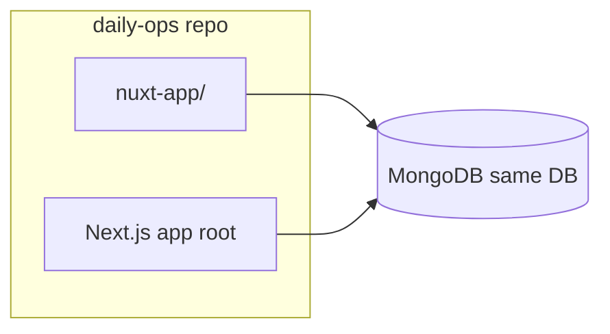

# Nuxt 4 + Nuxt UI + Tailwind v4 POC (Notes only)

## Agent rules (must follow during implementation)

When implementing this plan, follow the project's agent rules from [.cursor/rules/agent-rules.mdc](.cursor/rules/agent-rules.mdc). Summary:

**Workflow**
- Plan → wait for approval → execute (no code shown) → brief result summary.
- Never show code unless asked "show me"; use `startLine:endLine:filepath` for references.

**Critical rules**
1. **Registry check:** Before editing existing app files, grep `function-registry.json` for that path; if `touch_again: false`, ask first.
2. **Protected files:** Do not edit protected files without permission.
3. **Metadata headers:** When modifying critical files (hooks, services, types, API routes), read `@exports-to`, update `@last-modified` / `@last-fix`, and update dependents together.
4. **Size limits:** Max ~100 lines/change, ~20 lines/delete; avoid >80% replacements.
5. **No `any`:** Use types throughout.
6. **No DB in UI:** Data only via server/API (Nitro server routes for Nuxt; no direct DB in Vue pages).
7. **Pagination:** Use skip/limit for list endpoints (notes list).
8. **No console.log:** Production code stays silent.
9. **Small commits:** One commit per feature chunk with message `feat: [what] in [where]`.

**Prohibitions**
- Do not delete `function-registry.json`, `.cursor/rules/`, or metadata headers.
- Do not load the full function-registry; use grep.
- New Nuxt app files in `nuxt-app/` are not in the Next app registry; registry checks apply only when touching existing root-level app files.

**After completing work**
- If any existing app files were changed: update `function-registry.json` (status, touch_again) and commit.

---

## Scope

- **Stack:** Nuxt 4, @nuxt/ui (v4), Tailwind CSS v4.
- **Port:** Nuxt dev server on **localhost:8080**.
- **Feature:** Daily-ops **notes** only: list notes, view one note, create note, edit note (single list + detail/create/edit).

## Repo layout

- New directory: **`nuxt-app/`** at repo root (own `package.json`).
- Next.js app stays at repo root; no changes to existing Next code.

## 1. Create Nuxt 4 app and install UI stack

- **Create app:** From repo root, run `npm create nuxt@latest nuxt-app` (choose Nuxt 4). Minimal template.
- **Install:** In `nuxt-app/` add `@nuxt/ui` and Tailwind v4 per Nuxt UI docs; add `@nuxt/ui` to `modules` in `nuxt.config.ts` and CSS imports (e.g. `@import "tailwindcss"; @import "@nuxt/ui";`).
- **Port:** In `nuxt.config.ts` set `devServer.port: 8080`.

## 2. Notes backend (Nitro server routes + MongoDB)

- **Data:** Reuse Note shape from [app/lib/types/note.types.ts](app/lib/types/note.types.ts). Use native `mongodb` in Nitro (no Mongoose in Nuxt app).
- **Env:** Same `MONGODB_URI` (and optional `MONGODB_DB_NAME`); `nuxt-app/.env` mirrors root for MongoDB.
- **Server API** under `nuxt-app/server/api/`:
  - **GET /api/notes** — List notes (query: optional `archived`, `team_id`, `location_id`). Use skip/limit (pagination). Return `{ success, data: Note[] }`.
  - **GET /api/notes/[id]** — One note by `_id` or `slug`. Return `{ success, data: Note }` or 404.
  - **POST /api/notes** — Create (title, content, optional slug, author_id, tags, is_pinned). Return `{ success, data: Note }`.
  - **PUT /api/notes/[id]** — Update (partial). Return `{ success, data: Note }`.
- **DB:** `server/utils/db.ts` with `mongodb` connection, same DB name as Next app.

## 3. Notes frontend (Nuxt UI + Tailwind)

- **Routes:** `pages/index.vue` (list; useFetch `/api/notes`, pagination); `pages/notes/[id].vue` (view/create/edit; id can be `new`).
- **Components:** Nuxt UI (Button, Card, Input, Textarea) + Tailwind; minimal set.
- **Types:** `nuxt-app/types/note.ts` mirroring existing Note interface.

## 4. Port and scripts

- Nuxt: `devServer: { port: 8080 }` in `nuxt-app/nuxt.config.ts`.
- Root `package.json` (optional): e.g. `"dev:next": "next dev -p 3000"` for running Next alongside Nuxt.

## 5. Out of scope for POC

- No auth in Nitro.
- No my-notes vs public-notes; single list.
- No note-todo/member linking UI; core note CRUD only.

## File summary

| Area | Action |
|------|--------|
| Repo root | No changes (or optional `dev:next` script). |
| `nuxt-app/` | New: package.json, nuxt.config.ts, app.vue, pages/index.vue, pages/notes/[id].vue, server/api/notes/*.ts, server/utils/db.ts, types/note.ts, assets/css/main.css, .env. |

## Order of implementation

1. Create Nuxt 4 app in `nuxt-app/`, add @nuxt/ui + Tailwind v4, set port 8080.
2. Add MongoDB helper and Nitro API routes for notes (GET list with pagination, GET one, POST, PUT).
3. Add Note type and pages (index list, notes/[id] view/create/edit) with Nuxt UI.
4. Test: `cd nuxt-app && npm run dev`, open http://localhost:8080.
