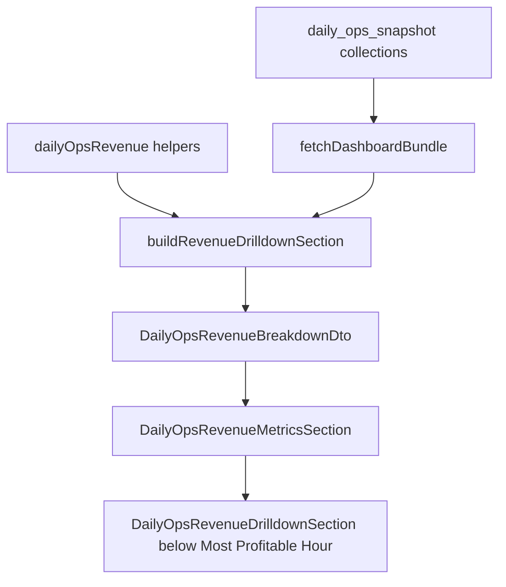

# Daily Ops Revenue Drilldown Plan

## Scope
Build the missing outline section directly below `Most Profitable Hour` in [`/Users/alviniomolina/Documents/GitHub/daily-ops/components/daily-ops/DailyOpsRevenueMetricsSection.vue`](/Users/alviniomolina/Documents/GitHub/daily-ops/components/daily-ops/DailyOpsRevenueMetricsSection.vue).

The feature should be modular, snapshot-first, and aligned with ADR-004/ADR-006: Daily Ops dashboard GET paths should read `daily_ops_snapshot*` / precomputed revenue data only, not live Bork/Eitje aggregation.

## Existing Coverage
Already built:
- KPI overall and per-venue drawers: [`/Users/alviniomolina/Documents/GitHub/daily-ops/components/daily-ops/DailyOpsKpiTiles.vue`](/Users/alviniomolina/Documents/GitHub/daily-ops/components/daily-ops/DailyOpsKpiTiles.vue)
- Venue strip: [`/Users/alviniomolina/Documents/GitHub/daily-ops/components/daily-ops/DailyOpsVenueStrip.vue`](/Users/alviniomolina/Documents/GitHub/daily-ops/components/daily-ops/DailyOpsVenueStrip.vue)
- Revenue by time of day plus P&L: [`/Users/alviniomolina/Documents/GitHub/daily-ops/components/daily-ops/DailyOpsProfitByIntervalCard.vue`](/Users/alviniomolina/Documents/GitHub/daily-ops/components/daily-ops/DailyOpsProfitByIntervalCard.vue)
- Most profitable hour: [`/Users/alviniomolina/Documents/GitHub/daily-ops/components/daily-ops/DailyOpsProfitHourCard.vue`](/Users/alviniomolina/Documents/GitHub/daily-ops/components/daily-ops/DailyOpsProfitHourCard.vue)
- Revenue analytics endpoints that can be reused or mirrored: `/server/api/daily-ops/revenue/*`

## Data Contract
Extend [`/Users/alviniomolina/Documents/GitHub/daily-ops/types/daily-ops-dashboard.ts`](/Users/alviniomolina/Documents/GitHub/daily-ops/types/daily-ops-dashboard.ts) with a focused `DailyOpsRevenueDrilldownDto` under `DailyOpsRevenueBreakdownDto`.

Include:
- `hourlyRows`: all locations and per-location hourly revenue, labor, COGS/fixed/profit when available.
- `hourlyBenchmark`: last 5 same-weekday median/average per hour with status `below | above | neutral`.
- `spaces`: per-space revenue rows.
- `top10`: workers, tables, food products, beverage products/categories.

## Server Modules
Add a small builder module rather than expanding one large file:
- Create [`/Users/alviniomolina/Documents/GitHub/daily-ops/server/utils/dailyOpsSnapshot/buildRevenueDrilldownSection.ts`](/Users/alviniomolina/Documents/GitHub/daily-ops/server/utils/dailyOpsSnapshot/buildRevenueDrilldownSection.ts)
- Wire it into [`/Users/alviniomolina/Documents/GitHub/daily-ops/server/utils/dailyOpsSnapshot/fetchDashboardBundle.ts`](/Users/alviniomolina/Documents/GitHub/daily-ops/server/utils/dailyOpsSnapshot/fetchDashboardBundle.ts)
- Reuse existing snapshot/revenue helpers where possible:
  - hourly/profit data already used for `mostProfitableHour` and `profitByInterval`
  - revenue endpoints/utilities under `/server/utils/dailyOpsRevenue/`
  - product/category/table/worker snapshot sections where already present

Avoid adding live Bork/Eitje reads to dashboard GET. Missing snapshot rows should return empty arrays plus clear coverage notes.

## UI Modules
Create a parent section component:
- [`/Users/alviniomolina/Documents/GitHub/daily-ops/components/daily-ops/DailyOpsRevenueDrilldownSection.vue`](/Users/alviniomolina/Documents/GitHub/daily-ops/components/daily-ops/DailyOpsRevenueDrilldownSection.vue)

Keep child components small:
- `DailyOpsRevenueHourlyTable.vue`
- `DailyOpsRevenueHourlyLineChart.vue`
- `DailyOpsRevenueBenchmarkLegend.vue`
- `DailyOpsRevenueSpaceTable.vue`
- `DailyOpsRevenueTop10Grid.vue`

Insert the parent below this existing line:

```vue
<DailyOpsProfitHourCard title="Most Profitable Hour" :data="revenue.mostProfitableHour" />
```

in [`/Users/alviniomolina/Documents/GitHub/daily-ops/components/daily-ops/DailyOpsRevenueMetricsSection.vue`](/Users/alviniomolina/Documents/GitHub/daily-ops/components/daily-ops/DailyOpsRevenueMetricsSection.vue).

## Agent Rule
Add a focused Cursor rule:
- [`/Users/alviniomolina/Documents/GitHub/daily-ops/.cursor/rules/daily-ops-revenue-drilldown.mdc`](/Users/alviniomolina/Documents/GitHub/daily-ops/.cursor/rules/daily-ops-revenue-drilldown.mdc)

Rule scope:
- `components/daily-ops/**/*.vue`
- `server/api/daily-ops/**/*.ts`
- `server/utils/dailyOps*/**/*.ts`
- `server/utils/dailyOps*.ts`
- `types/daily-ops*.ts`

Rule content should enforce:
- Snapshot-first dashboard reads.
- Modular components/builders.
- No direct Bork/Eitje live aggregation in Daily Ops dashboard GET.
- Add coverage/data-gap notes instead of hidden fallback behavior.
- Place this feature below `Most Profitable Hour`.

## Verification
Run focused checks:
- Dev server terminal check for Nuxt build/runtime errors.
- API smoke test for `/api/daily-ops/metrics/bundle?period=today&anchor=YYYY-MM-DD`.
- Confirm existing values still match: venue strip revenue, summary total, P&L interval sum.
- Verify new drilldown renders empty states gracefully when products/tables/spaces snapshots are missing.

## Data Flow

