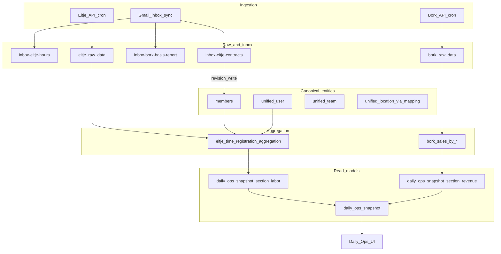

# Daily Ops — System Architecture

**Status:** Living document (update with every SSOT or business-rule change)  
**Stack:** Nuxt 4 · Nitro · MongoDB · Vue 3 · Nuxt UI  
**Decisions:** [DECISIONS.md](./DECISIONS.md) · **Roadmap:** [ROADMAP.md](./ROADMAP.md)

---

## 1. Purpose

Daily Ops integrates **Bork** (POS/revenue), **Eitje** (labor/hours), and **Gmail inbox** (CSV exports) into one operational view: dashboards, worker profiles, notes, and scheduled sync. The design optimizes for **pre-aggregated reads** on the dashboard and **canonical worker identity** across systems.

---

## 2. Data flow

**Rule:** Dashboard UI reads **snapshots only** (ADR-004). Member profile reads **`members`** (+ optional joins). Eitje inbox pages read **latest inbox rows** for operational review, not for dashboard KPIs.

---

## 3. Collection inventory

| Collection | Layer | Purpose | SSOT for | Written by | Read by |
|------------|-------|---------|----------|------------|---------|
| `members` | Canonical | HR/worker profile, compensation current + history | Worker identity (roster), current wages | CSV import, create-member API, compensation revision util, manual PUT | Member pages, Eitje agg (rates), staff hub |
| `unified_user` | Canonical | Cross-system person IDs (Eitje, Bork names) | Identity mapping | `eitjeSyncService`, scripts | Eitje agg, hours APIs, future AI tools |
| `unified_team` | Canonical | Team identity across Eitje | Team names/IDs | `eitjeSyncService` | Eitje agg |
| `bork_unified_user_mapping` | Mapping | Bork user → unified user | Bork waiter linkage | Admin/mapping jobs | `borkRebuildAggregationV2Service` |
| `bork_unified_location_mapping` | Mapping | Bork location → unified location | Location linkage | Mapping setup | Bork agg, snapshots |
| `inbox-eitje-contracts` | Inbox | Latest contract export rows | **Nothing** (input only) | `dataMappingService` (Gmail CSV) | Eitje staff page (latest view), legacy agg fallback |
| `inbox-eitje-hours` | Inbox | Shift/hours CSV lines | **Nothing** (input only) | `dataMappingService` | Inbox tables, validation |
| `inbox-bork-basis-report` | Inbox | Sealed revenue/labor basis emails | Revenue seal when `cron_hour=8` | Inbox process | Snapshot lead revenue |
| `eitje_raw_data` | Raw API | Eitje API payloads | — | `eitjeSyncService` | Eitje rebuild pipeline |
| `bork_raw_data` | Raw API | Bork daily tickets | — | Bork sync | `borkRebuildAggregationV2Service` |
| `eitje_time_registration_aggregation` | Aggregation | Per user/team/location/period labor totals + resolved rates | Labor facts per period | `eitjeRebuildAggregationService` | Snapshot labor section, metrics |
| `bork_sales_by_*` | Aggregation | Revenue rollups (hour, worker, product, …) | Revenue facts | `borkRebuildAggregationV2Service` | Snapshots, sales pages |
| `daily_ops_snapshot` | Read model | Master KPIs per location × business date | Dashboard cards | `dailyOpsSnapshotService` | `bundle.get`, home dashboard |
| `daily_ops_snapshot_section_labor` | Read model | Labor breakdown (teams, workers) | Dashboard labor detail | `buildLaborSection` | Dashboard, range rollups |
| `daily_ops_snapshot_section_revenue` | Read model | Revenue breakdown | Dashboard revenue detail | `buildRevenueSection` | Dashboard |
| `notes` | App data | Notes, todos, agrees (BlockNote JSON) | Note content | Notes API | Member connections, notes UI |

---

## 4. Canonical entities

### `members` (worker profile)

- Primary key: `_id`
- Links: `support_id`, `eitje_id` / `eitje_ids`, **`unified_user_id`** (ADR-003)
- Compensation: denormalized `contract_type`, `hourly_rate`, `cost_per_hour` + `compensationHistory[]` (intervals)
- **SSOT for current compensation** (ADR-001)

### `unified_user`

- Holds `eitjeIds`, `allIdValues`, `support_id`, `canonicalName`
- **SSOT for “same person” across Eitje/Bork** — not for HR fields or wages

### Notes linkage

- Notes link to workers via `connected_to.member_id` or `connected_member_ids`
- Todos/agrees live **inside** `notes.content` (parsed on read), not on `members`

---

## 5. Business rules

| Rule | Value |
|------|--------|
| Business day | **08:00 Amsterdam → 07:59:59** next calendar day |
| Eitje `period` | ISO date of shift start = `business_date` (no 00:00–07:59 shifts assumed) |
| Revenue in snapshots | **ex_vat**, **inc_vat**, **vat** from Bork line data — no fixed VAT divisor |
| Nul-uren loaded cost | `hourly_rate × 1.36` when contract type matches `/nul/i` and no stored `cost_per_hour` |
| Compensation effective date | `contract_start_date` from import if present, else `importedAt` (ADR-002) |
| Revision idempotency | No new row if material fields unchanged (ADR-005) |
| Dashboard reads | Snapshots only (ADR-004) |
| Timezone | Deploy with `TZ=Europe/Amsterdam` |

---

## 6. Inbox vs API

| Source | When used | Leading for |
|--------|-----------|-------------|
| **Gmail inbox** | Scheduled + manual sync; CSV attachments | Contract/hours **imports** → inbox collections → member revisions |
| **Eitje API** | Cron `integrations:bork-eitje-daily` | Raw shifts → aggregation |
| **Bork API** | Same cron | Raw tickets → Bork aggregation |
| **Inbox basis 08:05** | `cron_hour=8` | Seals prior business day snapshot `status: final` |

Inbox rows are **never** the runtime source for member profile compensation (ADR-001). They trigger revision writes when contract data changes.

---

## 7. Snapshot model

Collections (see `types/daily-ops-snapshot.ts`):

- `daily_ops_snapshot` — master KPIs
- `daily_ops_snapshot_section_labor` — labor totals, per-worker lines
- `daily_ops_snapshot_section_revenue` — revenue breakdown

**Writers:** `server/services/dailyOpsSnapshotService.ts` — aggregated inputs only, denormalized names at write time.

**Triggers:** Eitje/Bork rebuild complete, inbox basis seal, coalesced job queue.

---

## 8. Conventions for contributors and agents

1. **Metadata headers** on critical server files: `@registry-id`, `@exports-to`, `@last-modified`, `@last-fix`
2. **`@adr-ref:`** when implementing a locked decision (e.g. `@adr-ref: ADR-001`)
3. **SSOT changes** → update this file + new ADR in `DECISIONS.md` in the same commit
4. **Registry:** `grep function-registry.json` before editing tracked files
5. **No `console.log`** in production paths

---

## 9. Future: AI extraction layer

Planned read-only tools over snapshots + `members` + `compensationHistory` — see [ROADMAP.md](./ROADMAP.md). Models must not query raw Mongo directly; tools enforce collection boundaries and business rules above.

---

## 10. Related docs

| Doc | Topic |
|-----|--------|
| [dev-docs/DAILY_OPS_SNAPSHOT_PLAN.md](./dev-docs/DAILY_OPS_SNAPSHOT_PLAN.md) | Snapshot implementation detail |
| [dev-docs/COMPENSATION_REVISIONS_PLAN.md](./dev-docs/COMPENSATION_REVISIONS_PLAN.md) | Compensation feature build steps |
| [dev-docs/TIMEZONE_AND_DEPLOYMENT.md](./dev-docs/TIMEZONE_AND_DEPLOYMENT.md) | TZ and cron |
| [dev-docs/BORK_REVENUE_LOGIC_AND_AGGREGATION.md](./dev-docs/BORK_REVENUE_LOGIC_AND_AGGREGATION.md) | Bork VAT and aggregation |
