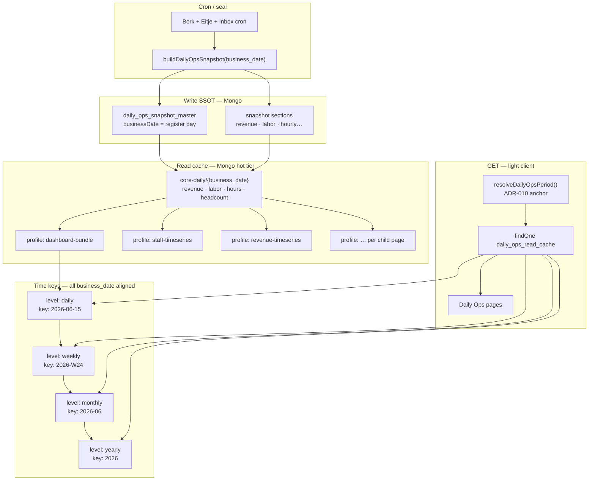
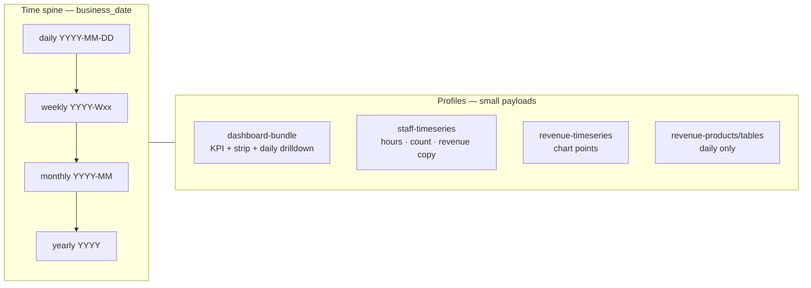
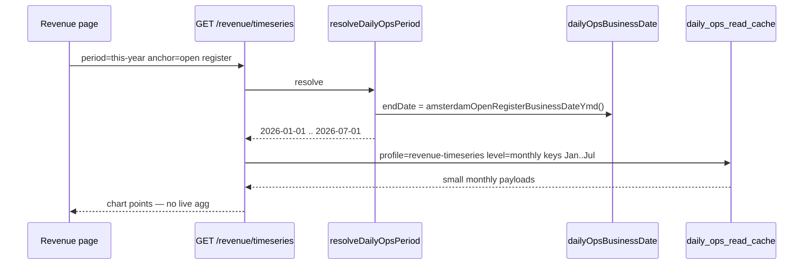

# Daily Ops Light Read-Cache (ADR-013 + ADR-010)

**SSOT:** [ADR-013](../DECISIONS.md#adr-013--light-read-cache-small-hierarchical-json-in-mongo-all-daily-ops-pages) · [ADR-010 register business day](../DECISIONS.md#adr-010--register-business-day-is-ssot-for-daily-ops-today)

**Goal:** Keep the **client light**. Server prebuilds small JSON after snapshot writes; GET handlers read cache only — no aggregation on request.

---

## Architecture diagram



---

## Profile × time matrix



| Profile | daily | weekly | monthly | yearly | Status |
|---------|-------|--------|---------|--------|--------|
| `dashboard-bundle` | full detail + strip | totals | totals | totals | Partial → migrate to Mongo |
| `staff-timeseries` | points + teams | summed | summed | summed | **Not built** |
| `staff-plusmin` | — | — | totals | totals | **Not built** |
| `revenue-summary` | KPI totals | totals | totals | totals | **Reserved** |
| `revenue-timeseries` | point | point | point | point | **Reserved** |
| `revenue-categories` | breakdown | — | — | — | **Reserved** |
| `revenue-products` | top products | — | — | — | **Reserved** |
| `revenue-rolling-medians` | median KPIs | point | point | point | **Reserved** |

Rollups = **totals only**. Dimension breakdowns (products, tables, spaces) = **daily profiles only**.

---

## Register business day rules (ADR-010)

All cache read/write paths must use the same SSOT as snapshots and UI.

| Rule | Implementation |
|------|----------------|
| **Daily key** | `business_date` YYYY-MM-DD = register **opened** that calendar morning (08:00 Amsterdam), not UTC midnight |
| **“Today”** | `amsterdamOpenRegisterBusinessDateYmd()` only — never `new Date().toISOString().slice(0,10)` |
| **Period tabs** | `resolveDailyOpsPeriod()` → inclusive `startDate` / `endDate` as business dates |
| **Partial periods** | `this-week`, `this-month`, `this-year` cap `endDate` to **open register** (not future calendar days) |
| **Snapshot join** | Cache writers read snapshots where `businessDate === cache daily key` |
| **Eitje labor** | `eitje_time_registration_aggregation.period === business_date` (already snapshot rule) |
| **Hourly detail** | Wall-clock hour 00–07 → previous calendar date’s register day via `calendarHourToBusinessDate()` |
| **Week boundaries** | ISO week keys (`YYYY-Wxx`); member days = business_date dailies inside that week |
| **Forbidden** | ISO calendar “today” for cache keys, GET paths, or rollup iteration |

**Open register day:** intraday cache refresh after each cron; same `business_date` key overwritten until next register day.

---

## End-to-end read example



Staff revenue overlay: **`staff-timeseries`** points include `revenue_ex_vat` copied at write from the same snapshot as `core-daily` — no cross-profile GET at runtime.

---

## Mongo document shape

**Collection:** `daily_ops_read_cache`

| Field | Example |
|-------|---------|
| `profile` | `dashboard-bundle`, `staff-timeseries`, `revenue-timeseries` |
| `level` | `daily` \| `weekly` \| `monthly` \| `yearly` |
| `key` | `2026-06-15`, `2026-W24`, `2026-06`, `2026` (business-date aligned) |
| `locationId` | `all` or venue id |
| `businessDateStart` | optional — rollup range start (business_date) |
| `businessDateEnd` | optional — rollup range end (business_date) |
| `payload` | Small JSON blob |
| `lastBuiltAt` | Invalidation vs snapshot |

**Index:** unique `{ profile, level, key, locationId }`

---

## Write triggers + incremental cascade

**Trigger:** after every `buildDailyOpsSnapshot({ businessDate })` — including intraday open register.

**Incremental rule — only touch what changed:**

```
snapshot rebuilt for business_date = 2026-07-01
 ↓
1. rewrite daily/2026-07-01 (all profiles)
2. rewrite weekly/2026-W27   ← contains Jul 1
3. rewrite monthly/2026-07   ← contains Jul 1
4. rewrite yearly/2026       ← contains Jul 1

Past sealed periods (2026-06, 2025, etc.) → untouched
```

**Parent rollup rewrite condition:** only when a daily doc *inside* that period actually changed. No cron-wide rebuild of all months/years every time.

**Backfill:** if a historical snapshot is corrected (e.g. via `buildDailyOpsSnapshotRange`), cascade upward for only the affected date's parent week/month/year.

**Open register day:** overwrite same `business_date` key on each cron until register closes and day seals. Weekly/monthly/yearly follow same overwrite — no delete, upsert only.

**Sealed days:** rewrite only when `forceReopenSealed` / warm tier newer (same guard as snapshot write).

---

## Read path (API)

1. `resolveDailyOpsPeriod()` (ADR-010) → `{ startDate, endDate }` business dates
2. Map to `{ profile, level, key, locationId }`
3. `findOne` / compose from monthly/yearly docs
4. Miss → `dataGap` + ops notification — **no** live assembly on GET

---

## Metadata headers — full stack (implementation plan)

**Goal:** Every Daily Ops file in the data chain gets a metadata header with **correct JSON / cache refs**. No skipping. Headers are slightly bigger; AI can change code without re-discovering read-cache wiring.

**Scope — header required on:**

| Layer | Path pattern | When |
|-------|--------------|------|
| GET API | `server/api/daily-ops/**/*.ts` | Always |
| Write / cache | `server/utils/dailyOpsSnapshot/*`, `server/services/dailyOpsSnapshotService.ts`, `server/plugins/bundle-cache-catchup.ts` | Always |
| Fetch utils | `server/utils/dailyOps{Metrics,Staff,Revenue,Insights}/*.ts` | Always |
| Composables | `composables/useDailyOps*.ts` | Always |
| Pages | `pages/daily-ops/**/*.vue` | Always |
| Components | `components/daily-ops/**/*.vue` | Always (any file that renders metrics or calls `/api/daily-ops/*`) |
| Types | `types/daily-ops-*.ts` | When payload shape matches a cache profile |

**Not read-cache (still need header + `@data-source: direct-db`):** `/daily-ops/staff` member list, inbox CRUD, Eitje/Bork admin, product-catalog sync.

### Required header fields (ADR-013 extensions)

Use existing metadata format (`.cursor/rules/METADATA-SYNC-GUIDE.md`) **plus**:

| Tag | Who | Value |
|-----|-----|--------|
| `@adr-ref` | All in chain | `ADR-004`, `ADR-010`, `ADR-013` (+ `ADR-006` if retention) |
| `@read-cache-json` | GET, composable, page, component | `daily_ops_read_cache` profile + levels, e.g. `dashboard-bundle · daily\|weekly\|monthly\|yearly` |
| `@write-cache-json` | Snapshot/cache writers | Profiles written + cascade trigger, e.g. `dashboard-bundle · daily→weekly→monthly→yearly after buildDailyOpsSnapshot` |
| `@data-source` | Any file | `read-cache` \| `snapshot-write-only` \| `direct-db` \| `mixed` |
| `@imports-data-from` | Page / component | Composable or GET path (one hop) |
| `@exports-to` / `@imports-from` | Unchanged | Keep dependency graph accurate |

**`@read-cache-json: none`** only when `@data-source: direct-db` (e.g. staff member list).

### Header templates

**GET handler (read-cache target):**
```typescript
/**
 * @registry-id: dailyOpsRevenueTimeseries
 * @description: Revenue chart points — read-cache only (ADR-013)
 * @adr-ref: ADR-004, ADR-010, ADR-013
 * @data-source: read-cache
 * @read-cache-json: daily_ops_read_cache · profile=revenue-timeseries · levels=daily|weekly|monthly|yearly
 * @imports-from:
 *   - server/utils/dailyOpsRevenue/fetchRevenueDailySeries.ts
 * @exports-to:
 *   ✓ composables/useDailyOpsRevenueMetrics.ts
 */
```

**Cache writer:**
```typescript
/**
 * @registry-id: dailyOpsPreGenerateBundleCache
 * @adr-ref: ADR-004, ADR-010, ADR-013
 * @data-source: snapshot-write-only
 * @write-cache-json: daily_ops_read_cache · dashboard-bundle · daily+weekly+monthly+yearly · after buildDailyOpsSnapshot(businessDate)
 * @exports-to:
 *   ✓ server/services/dailyOpsSnapshotService.ts
 */
```

**Composable / page / component:**
```typescript
/**
 * @description: Staff totals charts — consumes staff-timeseries JSON via API
 * @adr-ref: ADR-013
 * @data-source: read-cache
 * @read-cache-json: staff-timeseries (via GET /api/daily-ops/staff/timeseries)
 * @imports-data-from: composables/useDailyOpsStaffMetrics.ts
 */
```

### Page → JSON profile map (SSOT for AI)

| Route | Primary JSON profile | GET API | Composable | Header status |
|-------|---------------------|---------|------------|---------------|
| `/daily-ops` | `dashboard-bundle` | `/metrics/bundle`, `/metrics/venue-strip` | `useDailyOpsDashboardMetrics` | Partial — missing ADR-013 + `@read-cache-json` on several files |
| `/daily-ops/staff` | — (`direct-db` members) | `/staff`, `/eitje-staff` | `useDailyOpsStaffMetrics` | Missing on page + GET |
| `/daily-ops/staff/totals` | `staff-timeseries` | `/staff/timeseries` | `useDailyOpsStaffMetrics` | Missing on GET + page + chart components |
| `/daily-ops/staff/plusmin` | `staff-plusmin` | `/staff/plusmin-summary` | `useDailyOpsStaffPlusmin` | Partial composable only |
| `/daily-ops/revenue` | `revenue-summary`, `revenue-timeseries`, … | `/revenue/*` | `useDailyOpsRevenueMetrics` | **Reserved** — no revenue GET headers yet |
| `/daily-ops/insights` | TBD (likely `dashboard-bundle` subset) | `/insights` | `useDailyOpsInsightsMetrics` | Partial composable only |
| `/daily-ops/productivity` | `dashboard-bundle` labor slice | `/productivity`, `/metrics/labor` | mixed | Missing most headers |
| Inbox / settings / datalab | `direct-db` | various | — | Needs `@data-source: direct-db` only |

Revenue child APIs → profile mapping (wire when page is built; headers **now** with `@read-cache-json` + `Status: reserved`):

| GET API | Profile | Levels |
|---------|---------|--------|
| `/revenue/summary` | `revenue-summary` | daily–yearly |
| `/revenue/timeseries` | `revenue-timeseries` | daily–yearly |
| `/revenue/categories` | `revenue-categories` | daily |
| `/revenue/products` | `revenue-products` | daily |
| `/revenue/rolling-medians` | `revenue-rolling-medians` | daily–yearly |
| `/revenue/per-table`, `/per-location-space`, … | `revenue-*` daily breakdown | daily only |

### Implementation checklist (do not skip layers)

1. **Writers first** — `preGenerateBundleCache.ts`, `cacheCascade.ts`, `dailyOpsSnapshotService.ts`: add `@write-cache-json`, `@adr-ref: ADR-013`. ✅ **Done 2026-07-02** — Mongo `daily_ops_read_cache` writes + totals-only rollups
2. **GET handlers** — all `server/api/daily-ops/**`: add full header; `@read-cache-json` = target profile (or `none` + `direct-db`). ✅ **Done 2026-07-02**
3. **Fetch utils** — align `@read-cache-json` / `@write-cache-json` with GET and writers; update `@adr-ref`. ✅ **Partial** — snapshot/staff/revenue fetch utils done
4. **Composables** — all `useDailyOps*`: `@read-cache-json` via API path; `@imports-data-from` chain. ✅ **Done 2026-07-02**
5. **Pages** — all `pages/daily-ops/**`: `@read-cache-json` or `direct-db`; `@imports-data-from` composable. ✅ **Done 2026-07-02**
6. **Components** — all `components/daily-ops/**` that display metrics: same as parent page or composable ref. 🔄 **Partial** — main metric components done; remaining chart shells TBD
7. **Types** — `types/daily-ops-*.ts`: note matching profile in `@description` when DTO = cache payload shape. ⏳ **Pending**

**Remaining code work:** staff/revenue profile **writers** (not just headers), backfill script for historical Mongo cache, types headers.

---

## Local dev

`.cache/` may mirror Mongo for debugging. Production SSOT = **`daily_ops_read_cache`**.

---

## Migration (from ADR-008 filesystem)

- Totals-only rollups; no fat PBI/drilldown merge into month/year
- Mongo storage; staff + revenue profiles
- All keys via `dailyOpsBusinessDate.ts` + `resolveDailyOpsPeriod`

**Related:** ADR-004, ADR-006, ADR-008, ADR-010, ADR-011, `ARCHITECTURE.md`
