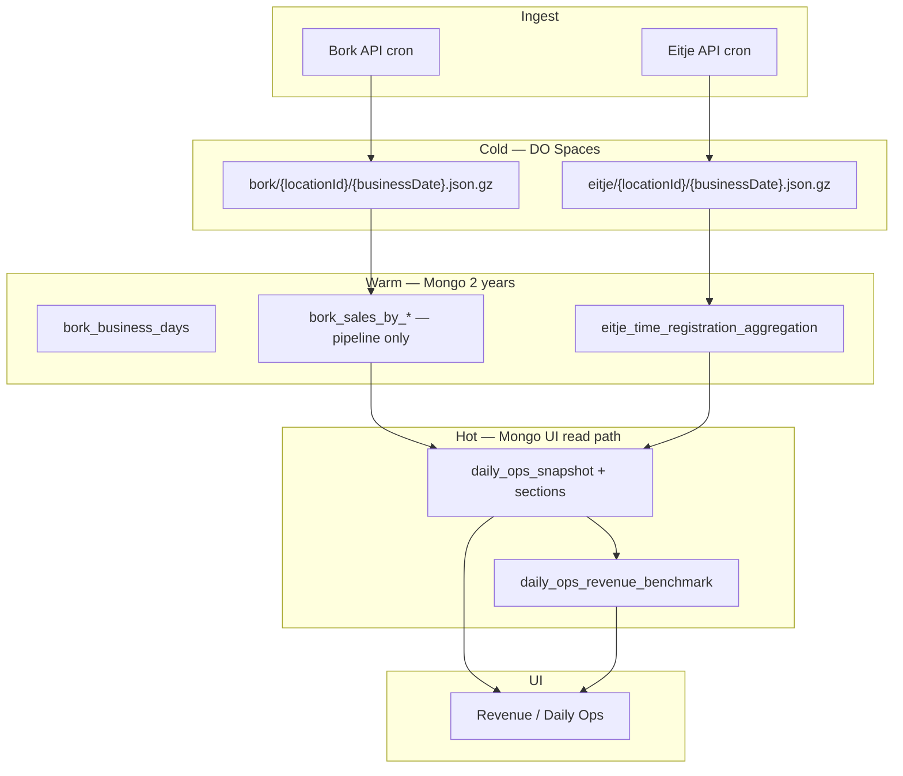

# Data retention & tiering — final plan

**Status:** Approved (pending implementation)  
**ADR:** [ADR-006](../DECISIONS.md#adr-006--hot--warm--cold-data-tiers)  
**Related:** [ARCHITECTURE.md](../ARCHITECTURE.md) · [DAILY_OPS_SNAPSHOT_PLAN.md](./DAILY_OPS_SNAPSHOT_PLAN.md)

---

## 1. Goals

1. **Dashboard & Revenue UI** — fast reads from snapshots only (no live Bork/Eitje aggregation on page load).
2. **Analytics up to 2 years** — compare periods (`this-year`, `last-year`, `year-2`, quarters, etc.) without raw scans.
3. **Small Mongo footprint** — raw payloads in **DO Spaces blobs**; no duplicate fat shapes for serving.
4. **Operational drill-down ~90 days** — Hours shift rows, sales line debug; older via on-demand rebuild.
5. **Immutable history** — once a business day is `final`, raw does not change; safe to archive and delete from Mongo.

---

## 2. Tier model



| Tier | Storage | Retention | Purpose |
|------|---------|-----------|---------|
| **Hot** | Mongo snapshots + precomputed benchmark | **2 years** | All Revenue / Daily Ops **read APIs** |
| **Warm** | Mongo day-level + rebuild aggregates | **2 years** (day totals); fat slices **until snapshot sealed** | Analytics source, snapshot writers, rare rebuilds |
| **Cold** | DO Spaces blobs | **Indefinite** | Audit + on-demand rebuild only |

**“60-day window”** = SLA for completeness + rolling KPI benchmark precompute — **not** a deletion cutoff for analytics.

**“90-day window”** = optional **Mongo** retention for shift-level / line-level drill-down collections before purge (after blob verified).

---

## 3. Collection policy

### 3.1 Cold — blobs only (both Bork and Eitje raw)

| Collection | After pipeline success |
|------------|------------------------|
| `bork_raw_data` | Upload blob → verify → **delete Mongo doc** |
| `eitje_raw_data` (shift endpoints) | Same — **Eitje raw is small but same rule as Bork** |

**Blob key layout:**

```
s3://{bucket}/cold/
  bork/{locationId}/{businessDate}.json.gz
  eitje/{locationId}/{businessDate}.json.gz
```

**Pipeline gate (per business day × location):**

1. Raw ingested (or rebuilt from blob).
2. Warm aggregates rebuilt (`bork_*`, `eitje_time_registration_aggregation`).
3. Snapshot sections written; master `status: final` when inbox 08:05 seals revenue.
4. Blob written + checksum recorded in `daily_ops_snapshot.sources` (or small `archive_manifest` collection).
5. **Delete raw from Mongo** for that day.
6. **Delete fat Bork slices** for that day (see §3.3).

Master-data Eitje raw (`environments`, `teams`, `users`) — keep in Mongo (tiny, not day-scoped); not blobbed per day.

### 3.2 Hot — UI reads only (2 years)

| Collection | Content |
|------------|---------|
| `daily_ops_snapshot` | Master KPIs |
| `daily_ops_snapshot_section_revenue` | Day totals + **24 hourly slots** |
| `daily_ops_snapshot_section_labor` | Teams, workers, totals |
| `daily_ops_snapshot_section_revenue_products` | Top-N products (when implemented) |
| `daily_ops_snapshot_section_revenue_hourly` | Optional split if separated from revenue section |
| `daily_ops_revenue_benchmark` *(new)* | `{ locationId, asOfDate, windowDays: 60, avgDailyRevenue, avgDailyItems, avgEurPerItem }` |

**Rule:** Revenue overview bundle reads **hot only**. Missing snapshot → `dataGap: true`, not live Bork on GET.

### 3.3 Warm — aggregates (2 years day-level; fat slices ephemeral)

| Collection | Keep in Mongo | Drop when |
|------------|---------------|-----------|
| `bork_business_days` | **2 years** | Never before 2y (rollup of record) |
| `eitje_time_registration_aggregation` | **2 years** | Never before 2y |
| `bork_sales_by_hour` | Until snapshot hourly **final** | **Delete** for that `(locationId, businessDate)` after revenue snapshot sealed |
| `bork_sales_by_product` | Until snapshot products **final** | Same |
| `bork_sales_by_table`, `by_worker`, … | Same pattern | Drop per day after matching snapshot section exists |
| `eitje_raw_data` (shifts) | **90 days** optional in Mongo | After blob + agg; or immediate delete if Hours drill-down uses agg-only |

**No double storage for serving:** if hourly revenue is in snapshot, `bork_sales_by_hour` is **not** kept for reads — only as a transient rebuild buffer.

### 3.4 What UI pages read

| Page / feature | Read source | Fallback |
|----------------|-------------|----------|
| Daily Ops home, venue strip | Snapshot labor + revenue | None on GET |
| Revenue overview KPIs + daily chart | Snapshot + `daily_ops_revenue_benchmark` | None on GET |
| Revenue trends (2y) | Snapshot day series | Warm `bork_business_days` only in backfill jobs |
| Revenue hourly / mix | Snapshot hourly + products sections | Job queue if section missing |
| Hours aggregated | `eitje_time_registration_aggregation` or snapshot labor | — |
| Hours row detail (shift table) | `eitje_raw_data` ≤90d | **On-demand:** blob → temp rebuild → show |
| Sales day breakdown (line debug) | Snapshot products or warm agg ≤90d | On-demand from blob |

---

## 4. On-demand rebuild (older than 90 days)

Rare admin/debug flow — **not** synchronous on page load.

1. User picks archived `(source, locationId, businessDate)`.
2. Job: fetch blob → rebuild warm agg for that day → rebuild snapshot sections → return job id.
3. UI polls or notifies when ready (30–120s).

**Rebuild from snapshot** when granularity is enough (daily revenue, 24h chart, team labor totals) — **no blob** needed if snapshot exists.

**Rebuild from blob** when shift-level or product-line detail is required and neither raw nor fat agg exists in Mongo.

---

## 5. API / app slim-down

| Change | Why |
|--------|-----|
| `GET /api/daily-ops/revenue/overview` — single bundle | One DO round trip |
| Lazy-fetch tab endpoints (Trends, Hourly, Ruimtes) | No 12× parallel load |
| Benchmark written on snapshot seal | No 60-day scan on GET |
| Hard-disable Bork/Eitje fallback on revenue read path | ADR-004 enforcement |
| Nightly purge job | Raw delete, fat slice delete, blob manifest |

---

## 6. Implementation phases

### Phase A — Stop the bleeding (1–2 days)

- [ ] Snapshot backfill: last **60 days** × 3 venues — revenue + labor sections `final`.
- [ ] Revenue read path: snapshots only; remove live `fetchBorkRangeTotals` on GET.
- [ ] Precompute `daily_ops_revenue_benchmark` on snapshot write (60d window).
- [ ] Overview bundle endpoint; lazy tab loads (finish composable split).

### Phase B — Blob pipeline (3–5 days)

- [ ] DO Spaces client + env vars (`DO_SPACES_*` or reuse AWS S3-compatible config).
- [ ] `archiveRawDay()` — gzip JSON, upload, manifest row, delete Mongo raw (Bork + Eitje shifts).
- [ ] Hook after successful day pipeline in Bork/Eitje sync + snapshot seal.
- [ ] `scripts/rehydrate-day-from-blob.ts` for manual rebuild.

### Phase C — Fat aggregate purge (2–3 days)

- [ ] After snapshot seal: delete `bork_sales_by_hour|product|…` for that day.
- [ ] Nightly job: verify manifest + snapshot exist before delete.
- [ ] Metrics: Mongo collection sizes before/after.

### Phase D — Snapshot completeness for Revenue tabs (1–2 weeks)

- [ ] Implement / backfill `daily_ops_snapshot_section_revenue` hourly (already in type).
- [ ] Products top-N section for Mix tab.
- [ ] Hourly / Mix tabs read snapshot sections only.

### Phase E — 2-year backfill (background)

- [ ] Backfill snapshots from warm aggregates (no raw) for historical range.
- [ ] Keep `bork_business_days` + `eitje_time_registration_aggregation` for 2y validation.

### Phase F — On-demand archive UI (optional)

- [ ] Admin: “Load archived day” → queue rebuild from blob.
- [ ] Hours row detail: show “archived — request rebuild” when >90d and no raw.

---

## 7. Environment & ops

```bash
# DO Spaces (S3-compatible)
DO_SPACES_ENDPOINT=
DO_SPACES_BUCKET=
DO_SPACES_ACCESS_KEY=
DO_SPACES_SECRET_KEY=
DO_SPACES_COLD_PREFIX=cold

# Retention (days)
DATA_RETENTION_SNAPSHOT_YEARS=2
DATA_RETENTION_WARM_AGG_YEARS=2
DATA_RETENTION_RAW_MONGO_DAYS=0      # 0 = delete immediately after blob; 90 = grace for drill-down
DATA_RETENTION_BENCHMARK_WINDOW_DAYS=60
```

**Cron:** nightly `data-retention-purge` — enforce policies, log counts, alert on manifest/snapshot mismatch (never delete if seal incomplete).

---

## 8. Success metrics

| Metric | Target |
|--------|--------|
| Revenue overview API p95 | < 500ms |
| Mongo `bork_raw_data` + `eitje_raw_data` shift docs | → 0 steady state (blobs only) |
| Page load parallel API calls (overview) | 1 bundle |
| Snapshot coverage last 60d | 100% `final` |

---

## 9. Out of scope (v1)

- Re-fetch from Eitje/Bork live API for archived days (blob is SSOT for raw).
- Trimming `bork_business_days` before 2 years.
- Product co-occurrence / heavy analytics without pre-aggregated snapshot sections.

---

## 10. Locked decisions summary

1. **Blobs for all day-scoped raw** — Bork and Eitje shifts alike.  
2. **Snapshots = UI read path** for 2 years.  
3. **Warm day-level aggregates** kept 2 years.  
4. **Fat aggregates** are pipeline buffers — drop after snapshot sealed.  
5. **60d** = benchmark + completeness SLA; **90d** = optional Mongo grace for drill-down; **2y** = analytics.  
6. **No read-time aggregation** on Revenue overview (ADR-004 + ADR-006).

---

## 11. Agent rules, metadata headers & AI discoverability

### Agent rules (`.cursor/rules/agent-rules.mdc`)

Cursor **always applies** `agent-rules.mdc` in this repo. Retention rules are duplicated there under **“Data retention — hot / warm / cold (ADR-006)”**.

When implementing any phase:

1. **RULE #11** — update `@last-modified`, `@last-fix`, `@exports-to`, and **`@adr-ref: ADR-006`** on critical files (snapshot writers, revenue read utils, blob archiver, purge jobs).
2. **Architecture SSOT** — change `ARCHITECTURE.md` / `DECISIONS.md` only when the decision itself changes (ADR-006 is already accepted).
3. Grep `function-registry.json` before new archive/purge modules.

### Metadata header pattern

```typescript
/**
 * @registry-id: example
 * @description: Hot-path revenue read from snapshots
 * @adr-ref: ADR-004, ADR-006
 * @last-fix: [2026-05-24] ADR-006 — no per-day Bork on GET
 * @exports-to: ...
 */
```

### GitHub / AI access

| Doc | In repo | Linked from README |
|-----|---------|-------------------|
| `DECISIONS.md` (ADR-006) | Yes | **Yes** — “Architecture (read this first)” |
| `ARCHITECTURE.md` | Yes | **Yes** |
| `dev-docs/DATA_RETENTION_PLAN.md` | Yes | **Yes** |
| `.cursor/rules/agent-rules.mdc` | Yes | Cursor agents only |

Committed docs on GitHub are indexable by AI. **ADR in `DECISIONS.md` + README** is the portable SSOT; **agent-rules** is Cursor’s always-on enforcement layer.
